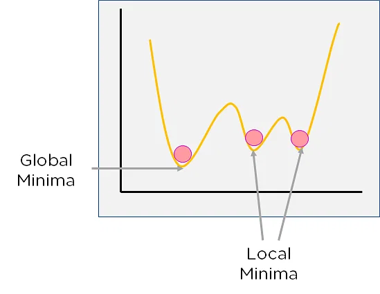
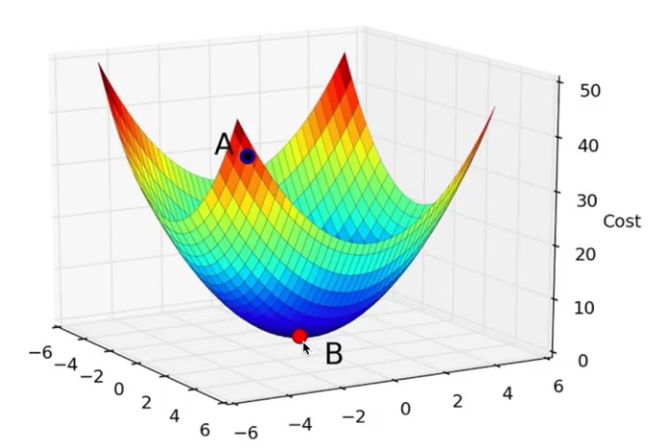
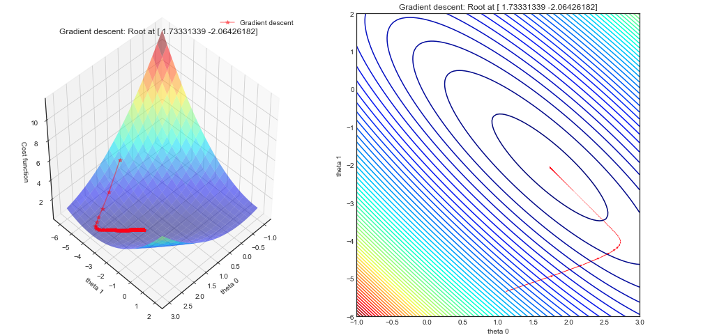
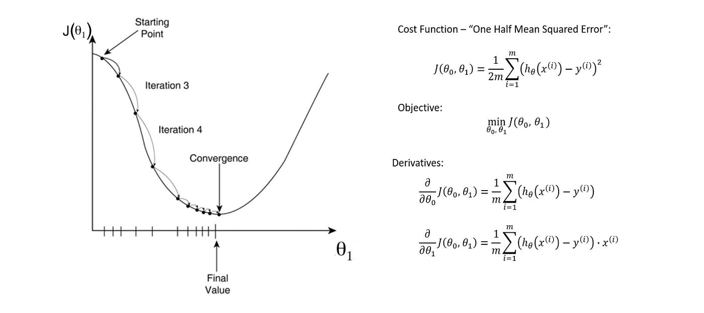

# Cost Function

A cost function is a function that measures the performance of a machine learning model for given data. Cost functions are also called loss functions or error functions. The goal of a machine learning model is to minimize the cost function. The cost function is a function of the model's parameters. The cost function is a measure of how wrong the model is in terms of its ability to estimate the relationship between X and y.

## Why Use a Cost Function?

The cost function is used to measure the performance of a machine learning model. The goal of a machine learning model is to minimize the cost function. The cost function is a function of the model's parameters. The cost function is a measure of how wrong the model is in terms of its ability to estimate the relationship between X and y. This is often done through a process of iterating over the model's parameters and minimizing the cost function.

## Review: Linear Regression Formula

The formula for a linear regression model is:

$$f_{x,b}(x) = wx + b$$

Notice that this takes the form of a line:

$$y = mx + b$$

where $m$ is the slope of the line and $b$ is the y-intercept.

## Single Variable Linear Regression

The cost function for a single variable linear regression model is the _mean squared error_ (MSE) cost function. The MSE cost function is defined as:

$$J(w, b) = \frac{1}{2m}\sum_{i=1}^{m}(f_{w,b}(x^{(i)}) - y^{(i)})^2$$

where $m$ is the number of samples, $x^{(i)}$ is the $i$th sample, $y^{(i)}$ is the $i$th label, and $f_{w,b}(x^{(i)})$ is the predicted value of $y$ for the $i$th sample. Note that the term inside the parenthesis is the difference between the actual value of $y$ and the predicted value of $y$, or the _error_. That value is scared, and the value is summed and divided by the number of samples $m$. Thus the name, _mean squared error_.

The value $2$ is added to the denominator to make the derivative of the cost function easier to calculate. When the derivative is taken, the $2$ that is the result of the squared term cancels out with the $\frac{1}{2}$.

## Plotting

It often helps to visualize the cost function. There are ways to visualize the cost function in 3D, but we will use a contour plot. A contour plot is a plot that shows the value of a function at different points in the input space. The contour plot is a 2D plot, so it is easier to visualize than a 3D plot. The contour plot is a plot of the cost function $J(w, b)$ as a function of $w$ and $b$.

### Two-Dimensional Plot

A two dimensional plot of the cost function is shown below. The x-axis is the value of $w$, the y-axis is the value of $b$, and the z-axis is the value of the cost function $J(w, b)$.

### Three-Dimensional Plot

A threed dimensional plot of the cost function is shown below. The x-axis is the value of $w$, the y-axis is the value of $b$, and the z-axis is the value of the cost function $J(w, b)$.

### Contour Plot

A contour plot of the cost function is shown below. The x-axis is the value of $w$, the y-axis is the value of $b$, and the z-axis is the value of the cost function $J(w, b)$. The contour plot is the one on the right, and for reference the 3D plot is on the left.

## Identifying the Minimum

The minimum of the cost function is the point where the cost function is at its lowest value. There may be local minima, but there is always only one global minimum. When using code to find the minimum, it is important to make sure that the minimum is the global minimum and not a local minimum.

### Gradient Descent

Gradient Descent is an algorithmic process of finding the minimum of a function. Gradient Descent is an iterative process. The algorithm starts at a random point, and then it takes a step in the direction of the steepest descent. The algorithm continues to take steps in the direction of the steepest descent until it reaches a point where the gradient is zero. The gradient is zero at the minimum of the function. In terms of the calculus involved, the gradient is the derivative of the function. The derivative of the function is zero at the minimum of the function.

